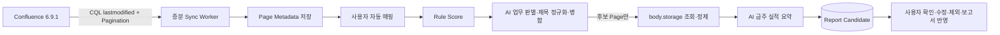

# Confluence Server 6.9.1 자동 초안

## 범위

이 연동의 단일 목적은 사용자가 Confluence 검색·선택·가져오기 작업을 하지 않아도 이번 주 활동에서 주간보고 후보를 자동 생성하는 것이다. Weekly는 Confluence 원본을 수정하지 않는다. 1차 범위는 본인이 생성한 Page와 본인이 마지막으로 수정한 Page이며 댓글, 첨부파일, 삭제 Page는 후보 생성에서 제외한다. Blog Post는 관리자 설정으로 선택할 수 있다.

참조 규격은 Atlassian의 [Confluence Server REST API 6.9.1](https://docs.atlassian.com/ConfluenceServer/rest/6.9.1/)과 [CQL 고급 검색](https://developer.atlassian.com/server/confluence/advanced-searching-using-cql/)이다.

## 처리 흐름

Worker는 마지막 성공 시각에 2분 중첩 구간을 더해 변경 누락을 방지한다. Page ID와 Version, 사용자, 주차를 이용해 같은 버전의 재분석을 AI 호출 전에 차단한다. 여러 서비스 복제본이 동시에 기동해도 PostgreSQL Advisory Lock으로 하나의 Worker만 수집한다.

## 인증

Confluence 6.9.1에서는 연동 전용 Service Account와 Basic Auth를 기본으로 사용한다. 사내 Reverse Proxy가 인증을 대행하는 환경은 `NONE`을 선택할 수 있다. Confluence 비밀번호는 React로 전달하지 않고 PostgreSQL의 암호화 설정으로 저장한다. HTTP Authorization Header, 본문 원문과 비밀번호는 로그에 기록하지 않는다.

Service Account에는 대상 Space의 읽기 권한만 최소로 부여한다. API 결과는 Confluence 화면에서 해당 계정이 조회할 수 있는 권한 범위를 따른다.

## 사용자 매핑

Weekly는 외부 사용자를 다음 우선순위로 유일하게 연결하고 `user_external_accounts`에 근거를 기록한다.

1. `EXPLICIT`: 관리자가 직접 지정
2. `EMAIL_LOCALPART`: Keycloak/Weekly 이메일의 `@` 앞부분 일치
3. `USERNAME`: Weekly 로그인 아이디 일치

`hkjang@koreacb.com`은 `hkjang`으로 자동 매핑된다. 한 외부 아이디가 여러 사용자와 일치하거나 한 사용자가 이미 다른 Confluence 아이디에 연결된 경우 자동 확정하지 않는다. 비활성화한 명시 매핑도 자동으로 되살리지 않는다. 관리자는 `Confluence 자동화` 탭에서 추천값, 매핑 근거와 미매핑 사용자를 확인한다.

## 관리자 설정

모든 값은 관리자 UI와 `app_settings`에서 관리하며 런타임 환경변수를 추가하지 않는다.

| 설정 | 기본값 | 의미 |
|---|---:|---|
| `confluence.enabled` | `false` | 자동 수집 활성화 |
| `confluence.base_url` | 없음 | `/confluence` Context Path를 포함한 Base URL |
| `confluence.auth_mode` | `BASIC` | `BASIC` 또는 `NONE` |
| `confluence.username` | 없음 | 연동 전용 계정 |
| `confluence.password` | 없음 | 암호화 저장되는 비밀번호 |
| `confluence.include_spaces` | 전체 | 쉼표로 구분한 허용 Space |
| `confluence.exclude_spaces` | 없음 | 항상 제외할 Space |
| `confluence.sync_interval_minutes` | `60` | 5~1,440분 증분 수집 주기 |
| `confluence.lookback_days` | `7` | 첫 수집 조회 범위 |
| `confluence.batch_size` | `50` | REST Pagination 크기, 최대 200 |
| `confluence.include_blogs` | `false` | Blog Post 포함 여부 |
| `confluence.ai_enabled` | `true` | 제목 분류·병합과 본문 요약 |
| `confluence.analyze_body` | `true` | 후보 Page의 본문 조회 |
| `confluence.minimum_candidate_score` | `50` | AI 정상 시 규칙 자동 후보 기준 |
| `confluence.ai_review_min_score` | `20` | AI 판단에 전달할 최소 기준 |
| `confluence.auto_map_email_localpart` | `true` | 이메일 로컬파트 자동 매핑 |
| `confluence.auto_map_username` | `true` | 로그인 아이디 자동 매핑 |

업무 키워드, 개인 Space 접두사와 작성·수정·회의·공지·휴가 등 점수도 같은 화면에서 조정한다. AI를 사용할 때는 공통 AI Gateway 설정의 Structured Output 지원 모델을 사용한다. AI 장애나 비활성 상태에서는 검토 최소 점수 이상인 제목을 보수적인 원본 제목 후보로 유지한다.

## 저장 데이터와 보안 경계

- `confluence_pages`: Page ID, Space, 제목, 작성자·수정자, 원본 시각, URL, Version, 제목·본문 해시
- `report_candidates`: 사용자, 주차, 정규화 제목, 구조화 실적·계획·이슈, 점수·신뢰도, 사용자 수정 여부
- `candidate_sources`: 하나의 후보와 여러 Confluence Page의 N:M 출처
- `confluence_sync_state`: 마지막 시도·성공, 상태와 처리 건수
- `confluence_sync_errors`: 최근 500건의 단계·HTTP 상태·안전한 오류 요약

`body.storage`는 메모리에만 머물며 script/style/XML 태그 제거와 HTML Entity 해제 후 크기를 제한해 AI에 전달한다. 원문은 DB, 감사 로그, 일반 로그에 저장하지 않는다. 외부 AI로 사내 문서를 전달할 수 없는 환경에서는 반드시 사내망 AI Gateway를 사용하거나 본문 분석을 끈다.

## 사용자 동작

주간보고 편집 화면은 자동 후보를 일반 업무보다 위에 표시한다. 사용자는 제목·구분·금주 실적·차주 계획·이슈를 수정하고, 원본 Page 링크를 확인하며, 후보를 제외하거나 보고서 항목으로 반영할 수 있다. 반영만으로 저장되지 않고 기존 임시저장/제출 동작을 거쳐야 한다.

- 수정한 후보는 `user_edited=true`가 되어 AI 재처리로 덮어쓰지 않는다.
- 제외한 후보는 source 연결을 유지한 채 `IGNORED`가 되어 같은 주차에 다시 생성되지 않는다.
- 보고서에 반영한 후보는 `ACCEPTED`와 보고서 ID를 기록한다.
- 반영한 보고서는 `source_type=CONFLUENCE_AI`로 추적한다.

일반 사용자에게 Confluence 검색, Import 또는 수동 Sync 버튼은 제공하지 않는다. 오래된 Sync 상태를 발견하면 보고서 화면 조회가 Worker를 비동기로 깨우지만 화면 요청을 기다리게 하지는 않는다.

## 장애 처리

| 상황 | 처리 |
|---|---|
| 401 | 인증 오류로 Sync 실패, 관리자 상태 화면에 표시 |
| 403/404 본문 | 해당 본문을 건너뛰고 제목 기반 후보 유지 |
| 429/5xx/네트워크 | 제한된 지수형 재시도 후 진단 기록 |
| AI 오류 | 제목 기반 후보와 출처 유지, 원문 미저장 |
| 일부 Page 저장 실패 | Batch는 계속 처리하고 상태를 `PARTIAL`로 기록 |
| Confluence 전체 장애 | 이미 생성된 후보와 주간보고 조회는 정상 동작 |
| 프로세스 재시작 | 남은 `RUNNING`을 실패로 정리하고 다음 주기에 재시도 |

관리자 `지금 증분 동기화`는 비동기 요청만 큐에 넣으며, 상태·건수·최근 오류는 `Confluence 자동화` 탭에서 확인한다.

## API

사용자 API:

- `GET /api/v1/reports/current/candidates`
- `PATCH /api/v1/report-candidates/{id}`
- `DELETE /api/v1/report-candidates/{id}`
- `GET /api/v1/report-candidates/{id}/sources`
- `POST /api/v1/report-candidates/accept`

관리자 API:

- `POST /api/v1/admin/settings/confluence/test`
- `POST /api/v1/admin/confluence/sync`
- `GET /api/v1/admin/confluence/sync/status`
- `GET /api/v1/admin/confluence/users/mappings`
- `GET /api/v1/admin/confluence/users/unmapped`
- `PUT /api/v1/admin/confluence/users/{id}/mapping`
