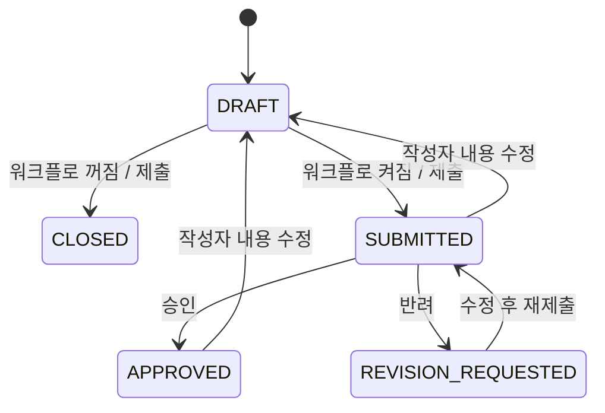
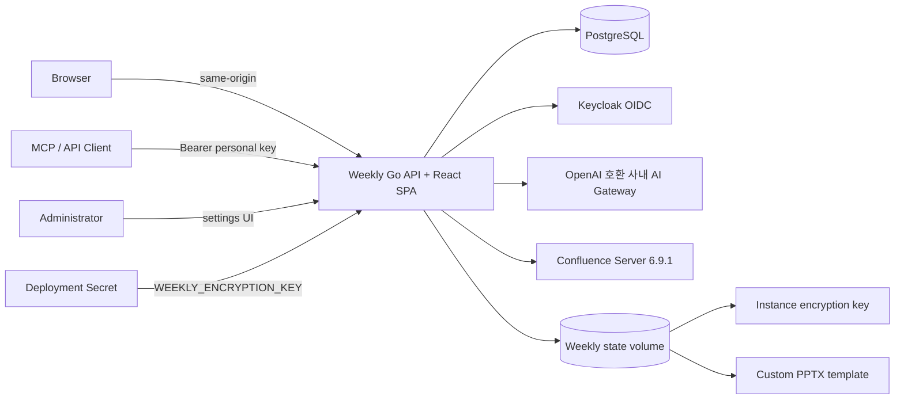
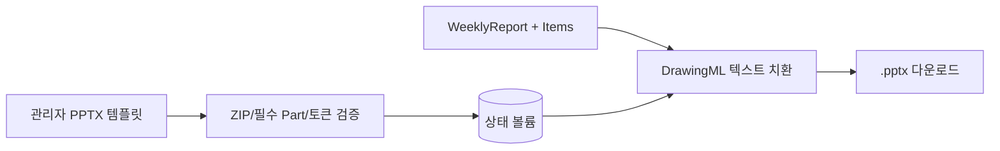
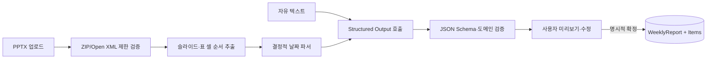

# Weekly 요구사항 및 시스템 설계

## 1. 목표와 범위

Weekly는 개인 주간 업무를 구조화하고 조직 단위로 조회·취합하는 내부 업무 서비스다. 1차 릴리즈는 작성, 임시저장, 제출, 선택형 검토, 이력, 검색, 분석을 포함하며 외부 SaaS 의존 없이 오프라인망에서 동작해야 한다.

핵심 원칙은 다음과 같다.

- 보고서는 문서 하나가 아니라 `WeeklyReport`와 여러 `ReportItem`으로 구성한다.
- 서버가 권한과 조직 범위를 항상 검증한다.
- 런타임 구성은 세 필수 환경변수와 선택형 고정 암호화 키로 부팅하고 이후 운영 설정은 관리자 UI에서 변경한다.
- 승인 절차는 기능 플래그가 아니라 상태 전이 규칙 자체를 바꾼다.
- AI/Jira 같은 후속 연계는 REST와 MCP 위에 추가하며 원본 보고서를 직접 변경하지 않는다.

## 2. 사용자와 권한

| 역할 | 본인 보고 | 동일/하위 조직 보고 | 승인·반려 | 관리자 화면 |
|---|---:|---:|---:|---:|
| USER | O | X | X | X |
| TEAM_LEADER | O | O | O | X |
| ORG_MANAGER | O | O | O | X |
| ADMIN | O | O | O | O |

조직은 adjacency list(`parent_id`)로 저장하고 재귀 CTE로 하위 조직 범위를 계산한다. 프론트엔드 메뉴 제어와 별개로 모든 조회/변경 API에서 다시 검사한다.

## 3. 상태 모델



워크플로 설정이 없거나 `false`이면 검토 API와 UI가 업무 흐름에서 제외되고 제출 즉시 `CLOSED`가 된다. 본인 보고서는 상태와 관계없이 수정·삭제할 수 있다. `SUBMITTED`·`APPROVED` 보고서의 내용 수정은 검토 효력을 무효화해 `DRAFT`로 전환하고, `CLOSED` 수정은 상태를 유지한다. 수정과 삭제 API는 `version` 일치 조건을 사용하며 불일치는 `409 VERSION_CONFLICT`를 반환한다. 과거 보고 복제는 원본 상태와 무관하게 별도의 `DRAFT`를 생성하고 댓글·승인 이력·외부 출처 연결을 상속하지 않는다.

## 4. 논리 아키텍처



Go 바이너리가 React 빌드 결과를 embed하여 단일 프로세스로 제공한다. Redis나 별도 API Gateway는 필수 구성요소가 아니다. `WEEKLY_ENCRYPTION_KEY`가 있으면 모든 복제본이 같은 비밀 설정을 복호화하고 기존 볼륨 키의 암호문도 첫 기동에 자동 재암호화한다. 환경 키가 없으면 하위 호환을 위해 상태 볼륨의 `instance.key`를 사용한다. 커스텀 PPTX와 Import 원본 때문에 현재 배포 예시는 단일 복제본과 RWO 볼륨을 사용한다.

## 5. 주요 데이터

- `users`, `organizations`: 계정, 역할, 계층 조직
- `weekly_reports`, `report_items`: 보고서 헤더와 업무 항목
- `report_comments`, `report_status_history`: 의견과 상태 이력
- `app_settings`: 관리자 설정, 비밀값 여부
- `user_sessions`, `oidc_login_states`: 인증 세션과 단기 OIDC 상태
- `personal_api_keys`: 해시만 저장하는 개인 API 키
- `audit_logs`: 보안·업무 변경 감사
- `api_request_metrics`: 시간 단위 API 요청 집계
- `pptx_templates`: 템플릿 파일 메타데이터
- `import_jobs`, `import_files`: PPTX 분석 작업, 원본 해시, 추출/AI 결과, 확정 보고 연결
- `weekly_reports.source_type/source_ref`: 수동·AI 텍스트·PPTX Import·복제 원본 등 데이터 출처
- `user_external_accounts`: Weekly 사용자와 Confluence 사용자 아이디, 매핑 근거
- `confluence_pages`, `confluence_sync_state`, `confluence_sync_errors`: Page Metadata와 증분 수집 상태·진단
- `report_candidates`, `candidate_sources`: 사용자별 자동 초안과 N:M 원본 Page 출처

마이그레이션은 바이너리에 포함되며 프로세스 시작 시 트랜잭션으로 순서대로 적용한다.

## 6. 인증과 키 관리

- 로컬 비밀번호: Argon2id, 64MiB, 3회, 병렬도 2
- 브라우저 세션: 256-bit 임의 토큰, DB에는 SHA-256만 저장
- OIDC: Discovery, Authorization Code, PKCE S256, state, nonce, ID Token issuer/audience/signature 검증
- API 키: `wky_` 접두사 임의 토큰, DB에는 SHA-256과 표시용 접두사만 저장
- 개인 키 회전: 사용자 `key_version` 증가 + 활성 키 전부 폐기. 이전 버전 키는 검증 단계에서도 거부
- 설정 비밀값: 고정 배포 키 또는 상태 볼륨 키를 사용하는 AES-256-GCM 암호화. 키 전환 시 기존 암호문을 트랜잭션으로 재암호화하고 복호화 불가 상태를 관리자에게 표시

## 7. PPTX 파이프라인



업로드한 Open XML 패키지의 모든 Part를 복사하고 `ppt/slides/slide*.xml`의 독립 토큰 텍스트만 치환한다. 이 방식은 템플릿의 레이아웃과 리소스를 재생성하지 않으므로 기준 규격을 보존한다.

## 8. AI 작성과 PPTX Import 파이프라인



AI는 DB Entity와 연결되지 않고 검증된 DTO만 반환한다. 자유 텍스트 결과는 독립 작업을 줄바꿈 글머리표로 정규화한 뒤 편집기 적용과 일반 저장 절차를 거치고, PPTX는 비동기 Import Job의 미리보기에서 사용자가 주차·항목과 충돌 전략을 확정해야 저장된다. 브라우저는 `FormData`의 multipart boundary를 직접 생성하며 공통 API 계층은 업로드에 JSON Content-Type을 덮어쓰지 않는다. 파일명·슬라이드 본문 날짜를 정규식으로 먼저 찾고, 단독 날짜는 관리자 주차 시작 요일에 맞춰 보정하며 명확한 날짜가 없을 때만 AI 날짜를 후보로 사용한다.

다중 업로드는 API 프로세스 내부 Worker와 PostgreSQL 잠금으로 처리한다. 동일 사용자 파일의 SHA-256을 비교해 중복을 표시하고, 동일 사용자·주차 충돌은 생성·병합·교체·건너뛰기 전략을 요구한다. 원본, 정규화 텍스트, AI 응답과 확정 보고의 연결을 분리해 재현성과 감사를 확보한다.

## 9. Confluence 자동 초안 파이프라인

```mermaid
  C[CQL 변경 Page] --> M[Metadata·Version 저장]
  M --> U[명시 매핑 / 이메일 로컬파트 / 아이디]
  U --> R[Rule Score]
  R --> B[제한된 body.storage 미리보기·구조 보존 정제]
  B --> A[제목+본문 AI 업무 분류·Cluster]
  B --> S[AI 사실 기반 요약]
  S --> P[(Report Candidate + Sources)]
  P --> E[사용자 검토·보고서 반영]
```

같은 Page Version은 AI 호출 전에 제거하고, 사용자 수정·제외·수락 상태를 재처리보다 우선한다. AI 분류 응답은 입력 Page 전체를 정확히 한 번씩 판정해야 하며 누락 시 결정적 폴백으로 전환한다. Confluence 원문 본문은 저장하지 않고 문단·목록·표 셀 경계를 보존한 제한 크기 입력을 AI에 일시 전달한 뒤 해시만 보존한다. Worker는 PostgreSQL Advisory Lock을 사용하므로 여러 인스턴스가 동시에 같은 Sync를 실행하지 않는다. 상세 규격은 [Confluence 연동 문서](CONFLUENCE.md)에 정의한다.

## 10. 확장 지점

- Jira Issue ID와 `report_items`의 관계 테이블
- 공급자별 AI Responses/Chat 어댑터와 사내 모델 평가
- 알림 Outbox와 사내 메일/메신저 어댑터
- 조직 템플릿과 주차 마감 스케줄러
- OpenTelemetry exporter 및 장기 분석 저장소
