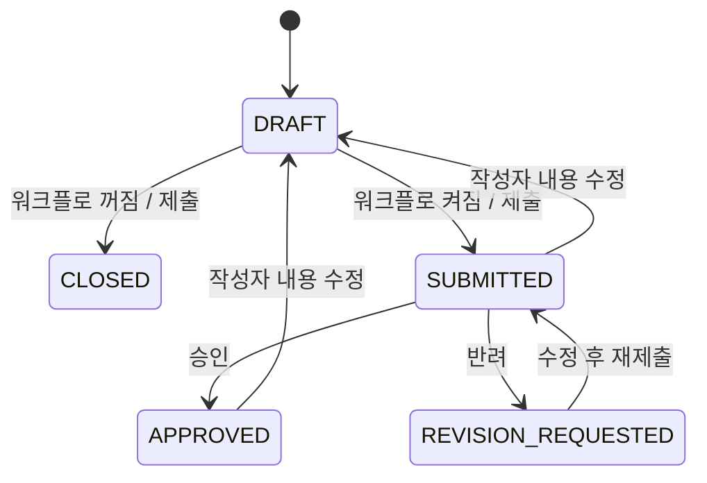
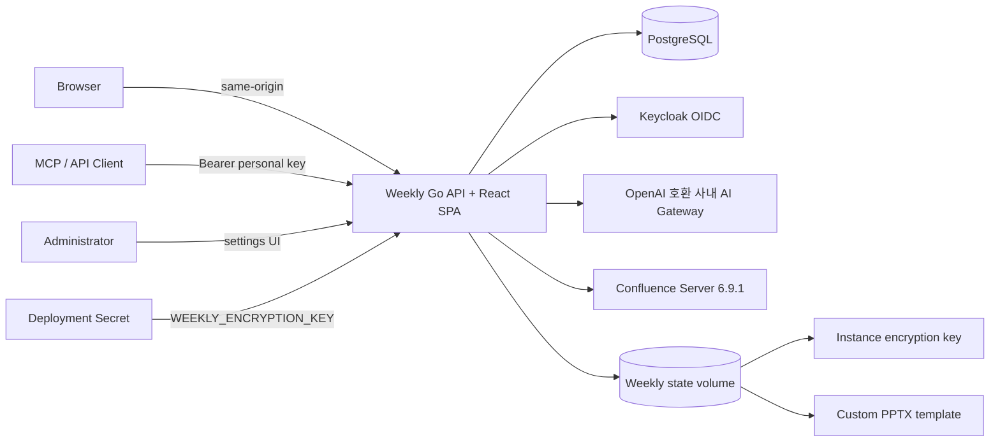
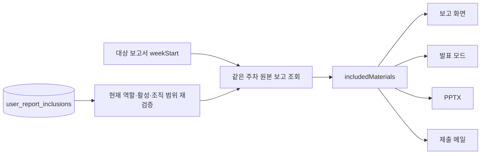
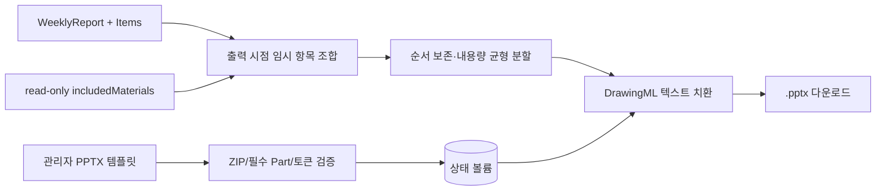
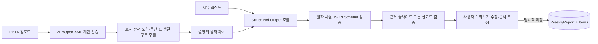

# Weekly 요구사항 및 시스템 설계

## 1. 목표와 범위

Weekly는 개인 주간 업무를 구조화하고 조직 단위로 조회·취합하는 내부 업무 서비스다. 1차 릴리즈는 작성, 임시저장, 제출, 선택형 검토, 이력, 검색, 분석을 포함하며 외부 SaaS 의존 없이 오프라인망에서 동작해야 한다.

핵심 원칙은 다음과 같다.

- 보고서는 문서 하나가 아니라 `WeeklyReport`와 여러 `ReportItem`으로 구성한다.
- 보고서의 작성자와 업무 항목은 한 사람에게만 귀속한다. 선택 팀원 자료는 조회 시 조합하는 읽기 모델이며 원본 보고 항목으로 복제하지 않는다.
- 서버가 권한과 조직 범위를 항상 검증한다.
- 런타임 구성은 데이터베이스 주소 하나와 선택형 고정 암호화 키로 부팅한다. 부트스트랩 관리자 2개 변수는 관리자가 없는 데이터베이스에서만 요구하고, 이후 운영 설정은 관리자 UI에서 변경한다.
- 승인 절차는 기능 플래그가 아니라 상태 전이 규칙 자체를 바꾼다.
- AI/Jira 같은 후속 연계는 REST와 MCP 위에 추가하며 원본 보고서를 직접 변경하지 않는다.

## 2. 사용자와 권한

| 역할 | 본인 보고 | 동일/하위 조직 보고 | 선택 팀원 자료 | 승인·반려 | 관리자 화면 |
|---|---:|---:|---:|---:|---:|
| USER | O | X | X | X | X |
| TEAM_LEADER | O | O | O (동일/하위 활성 사용자) | O | X |
| ORG_MANAGER | O | O | O (동일/하위 활성 사용자) | O | X |
| ADMIN | O | O | O (전체 활성 사용자) | O | O |

조직은 adjacency list(`parent_id`)로 저장하고 재귀 CTE로 하위 조직 범위를 계산한다. 프론트엔드 메뉴 제어와 별개로 모든 조회/변경 API에서 다시 검사한다.

## 3. 상태 모델



워크플로 설정이 없거나 `false`이면 검토 API와 UI가 업무 흐름에서 제외되고 제출 즉시 `CLOSED`가 된다. 본인 보고서는 상태와 관계없이 수정·삭제할 수 있다. `SUBMITTED`·`APPROVED` 보고서의 내용 수정은 검토 효력을 무효화해 `DRAFT`로 전환하고, `CLOSED` 수정은 상태를 유지한다. 수정과 삭제 API는 `version` 일치 조건을 사용하며 불일치는 `409 VERSION_CONFLICT`를 반환한다. 과거 보고 복제는 원본 상태와 무관하게 별도의 `DRAFT`를 생성하고 댓글·승인 이력·외부 출처 연결을 상속하지 않는다.

## 4. 논리 아키텍처



Go 바이너리가 React 빌드 결과를 embed하여 단일 프로세스로 제공한다. Redis나 별도 API Gateway는 필수 구성요소가 아니다. `WEEKLY_ENCRYPTION_KEY`가 있으면 모든 복제본이 같은 비밀 설정을 복호화하고 기존 볼륨 키의 암호문도 첫 기동에 자동 재암호화한다. 환경 키가 없으면 하위 호환을 위해 상태 볼륨의 `instance.key`를 사용한다. 커스텀 PPTX와 Import 원본 때문에 현재 배포 예시는 단일 복제본과 RWO 볼륨을 사용한다.

## 5. 주요 데이터

- `users`, `organizations`: 계정, 역할, 계층 조직
- `weekly_reports`, `report_items`: 보고서 헤더와 업무 항목
- `report_comments`, `report_status_history`: 의견과 상태 이력
- `user_report_inclusions`: 보고서 소유자와 직접 선택한 포함 대상의 N:M 관계. 보고 내용의 복사본은 저장하지 않음
- `app_settings`: 관리자 설정, 비밀값 여부
- `user_sessions`, `oidc_login_states`: 인증 세션과 단기 OIDC 상태
- `personal_api_keys`: 해시만 저장하는 개인 API 키
- `audit_logs`: 보안·업무 변경 감사
- `api_request_metrics`: 시간 단위 API 요청 집계
- `pptx_templates`: 템플릿 파일 메타데이터
- `import_jobs`, `import_files`: PPTX 분석 작업, 원본 해시, 추출/AI 결과, 확정 보고 연결
- `weekly_reports.source_type/source_ref`: 수동·AI 텍스트·PPTX Import·복제 원본 등 데이터 출처
- `user_external_accounts`: Weekly 사용자와 Confluence 사용자 아이디, 매핑 근거
- `confluence_pages`, `confluence_sync_state`, `confluence_sync_errors`: Page Metadata와 증분 수집 상태·진단
- `report_candidates`, `candidate_sources`: 사용자별 자동 초안과 N:M 원본 Page 출처

마이그레이션은 바이너리에 포함되며 프로세스 시작 시 트랜잭션으로 순서대로 적용한다.

## 6. 인증과 키 관리

- 로컬 비밀번호: Argon2id, 64MiB, 3회, 병렬도 2
- 브라우저 세션: 256-bit 임의 토큰, DB에는 SHA-256만 저장
- OIDC: Discovery, Authorization Code, PKCE S256, state, nonce, ID Token issuer/audience/signature 검증
- API 키: `wky_` 접두사 임의 토큰, DB에는 SHA-256과 표시용 접두사만 저장
- 개인 키 회전: 사용자 `key_version` 증가 + 활성 키 전부 폐기. 이전 버전 키는 검증 단계에서도 거부
- 설정 비밀값: 고정 배포 키 또는 상태 볼륨 키를 사용하는 AES-256-GCM 암호화. 키 전환 시 기존 암호문을 트랜잭션으로 재암호화하고 복호화 불가 상태를 관리자에게 표시

## 7. 선택 팀원 보고 자료의 읽기 모델



설정 API는 `GET/PUT /api/v1/me/report-inclusions`다. 응답은 서버 선택 상한 `maxMembers`를 포함하며 현재 값은 500이다. `TEAM_LEADER`와 `ORG_MANAGER`는 본인 조직과 하위 조직, `ADMIN`은 전체 조직의 활성 사용자를 직접 선택할 수 있으며 본인은 제외한다. 선택 관계가 남아 있어도 읽을 때마다 소유자의 현재 역할·조직과 대상의 현재 활성 상태를 다시 검사해 접근 범위 밖 자료를 가린다.

보고 상세를 읽을 때 보고서 소유자의 현재 선택과 그 보고서의 정확한 `weekStart`를 결합한다. 다른 사용자가 그 보고서를 읽으면 조회자 자신의 현재 조직 범위와도 교차해 바깥 보고서 권한보다 넓은 자료를 노출하지 않는다. 원본 상태는 필터링하지 않으며 보고서가 없는 선택 대상도 식별 정보와 빈 항목을 가진 미작성 자료로 남긴다. 본인의 현재 주차 보고서가 아직 없을 때는 별도 현재 주차 endpoint가 같은 조합을 반환한다.

`includedMaterials`는 응답·표시 시점의 파생 자료이며 `weekly_reports`나 `report_items`에 캐시·복제·스냅샷하지 않는다. 선택 대상의 `includedMaterials`를 다시 따라가지 않는 1단계 구조이므로 순환·재귀 포함이 없다. 선택 변경과 역할·조직·활성 상태 변경은 이후 과거 보고 조회와 새 출력에도 즉시 적용되지만, 보고서의 작성자·상태·버전·검토 이력에는 영향을 주지 않는다. 기간·팀 종합, 제출률, 업무 추적과 관리자 분석은 원본 업무만 사용해 이 자료를 중복 계산하지 않는다.

## 8. PPTX 파이프라인



업로드한 Open XML 패키지의 모든 Part를 복사하고 `ppt/slides/slide*.xml`의 독립 토큰 텍스트만 치환한다. 이 방식은 템플릿의 레이아웃과 리소스를 재생성하지 않으므로 기준 규격을 보존한다. 기본 다중 슬라이드 형식은 보고 항목 순서를 유지하는 연속 구간 분할을 사용한다. 구분·제목, 예상 줄바꿈과 실적·계획 중 더 높은 열을 비용으로 계산해 가장 높은 슬라이드를 최소화하고, 같은 최대 높이에서는 슬라이드별 부하 편차를 줄인다. 구분이 슬라이드 경계를 넘으면 다음 장에 구분 제목을 다시 렌더링하며 항목 자체는 복제하지 않는다.

PPTX 생성 직전에 선택 자료를 임시 `reportItem` 투영으로 평탄화해 본인 항목 뒤에 이어 붙인 다음, 합쳐진 출력 목록을 기본·관리자 템플릿의 `{{THIS_WEEK}}`·`{{NEXT_WEEK}}`·`{{ISSUES}}` 치환과 균형 분할에 전달한다. 팀원 업무의 임시 분류는 `선택 팀원 · 이름 (아이디) · 원래 분류`로 작성자 attribution과 원래 분류를 모두 보존하고, 미작성 대상도 이름·아이디와 미작성 상태를 출력한다. 이 투영은 요청 수명 안에서만 존재하며 DB 보고 항목이나 집계를 바꾸지 않는다.

## 9. AI 작성과 PPTX Import 파이프라인



AI는 DB Entity와 연결되지 않고 검증된 DTO만 반환한다. 모델 계약의 실적·계획·이슈는 원자 문자열 배열이며, 검증 후 외부 DTO의 줄바꿈 글머리표 문자열로 투영해 기존 보고서 저장 형식과 호환한다. PPTX 추출기는 ZIP 엔트리명이 아니라 `presentation.xml` 관계 순서로 슬라이드를 배열하고 표시 순서와 원본 `slideN.xml`을 함께 표기한다. 도형 이름, 여러 Text Run을 결합한 문단, 글머리표 문자·단계, 표의 행·열과 빈 셀을 별도 marker로 보존한다. 입력 상한에서는 슬라이드별 공정 예산을 배분하고 잘린 슬라이드에 `TRUNCATED` marker를 남겨 앞부분 독점을 막는다. 자유 텍스트는 근거 슬라이드를 사용하지 않고, PPTX 항목은 실제 추출된 표시 순서 슬라이드 집합에 포함된 `sourceSlides`와 별도 `categoryConfidence`를 요구한다. 존재하지 않는 슬라이드 또는 근거 없는 항목을 포함한 응답은 거부하며, 빈 구분은 낮은 신뢰도의 `미분류`로 제한한다. PPTX는 비동기 Import Job 미리보기에서 사용자가 주차·항목 순서와 충돌 전략을 확정해야 저장된다. 브라우저는 `FormData`의 multipart boundary를 직접 생성하며 공통 API 계층은 업로드에 JSON Content-Type을 덮어쓰지 않는다. 파일명·슬라이드 본문 날짜를 정규식으로 먼저 찾고, 단독 날짜는 관리자 주차 시작 요일에 맞춰 보정하며 명확한 날짜가 없을 때만 AI 날짜를 후보로 사용한다.

다중 업로드는 API 프로세스 내부 Worker와 PostgreSQL 잠금으로 처리한다. 동일 사용자 파일의 SHA-256을 비교해 중복을 표시하고, 동일 사용자·주차 충돌은 생성·병합·교체·건너뛰기 전략을 요구한다. 원본이 보관된 미확정 파일은 ID를 지정해 최신 파이프라인으로 다시 분석할 수 있고, 본문 없는 기존 재시도 요청은 실패 파일만 대상으로 유지한다. 낮은 신뢰도 결과는 UI에서 기본 선택하지 않으며 확정 시 주차 시작 요일과 동일 구분·제목 중복을 서버가 다시 정규화한다. 원본, 정규화 텍스트, AI 응답과 확정 보고의 연결을 분리해 재현성과 감사를 확보한다.

## 10. Confluence 자동 초안 파이프라인

```mermaid
  C[CQL 변경 Page] --> M[Metadata·Version 저장]
  M --> U[명시 매핑 / 이메일 로컬파트 / 아이디]
  U --> R[Rule Score]
  R --> B[제한된 body.storage 미리보기·구조 보존 정제]
  B --> V{Metadata/Body Version 일치}
  V -->|일치| A[제목+본문 AI 업무 분류·Cluster]
  V -->|불일치| N[진단 기록·다음 Sync 재처리]
  V -->|일치| S[AI 원자 사실 요약]
  S --> G[evidencePageIds 입력 집합 검증]
  G --> P[(Report Candidate + Sources)]
  P --> E[사용자 검토·보고서 반영]
```

같은 Page Version은 AI 호출 전에 제거하고, 사용자 수정·제외·수락 상태를 재처리보다 우선한다. AI 분류 응답은 입력 Page 전체를 정확히 한 번씩 판정해야 하며 누락 시 결정적 폴백으로 전환한다. 요약은 실적·계획·이슈의 독립 사실 배열로 받고 각 사실에 비어 있지 않은 `evidencePageIds`를 요구한다. 서버는 모든 근거 ID가 해당 AI 입력 Page 집합의 부분집합인지 검증하고 실패 사유를 포함해 한 번만 교정 호출한다. 재실패는 `AI_SUMMARY` 진단과 결정적 제목 기반 폴백으로 전환한다. 검색 메타데이터와 본문 API의 Page ID·Version이 다르면 해당 본문을 후보에 연결하지 않고 `BODY_VERSION_CHANGED` 진단 후 다음 중첩 Sync에서 다시 처리한다. Confluence 원문 본문은 저장하지 않고 제목·문단·목록·표 행과 셀 경계를 보존한 제한 크기 입력을 AI에 일시 전달한다. 한도를 넘으면 앞·뒤 문맥을 남긴 중간 생략 marker를 사용하며 DB에는 본문 해시만 보존한다. Worker는 PostgreSQL Advisory Lock을 사용하므로 여러 인스턴스가 동시에 같은 Sync를 실행하지 않는다. 상세 규격은 [Confluence 연동 문서](CONFLUENCE.md)에 정의한다.

## 11. 확장 지점

- Jira Issue ID와 `report_items`의 관계 테이블
- 공급자별 AI Responses/Chat 어댑터와 사내 모델 평가
- 알림 Outbox와 사내 메일/메신저 어댑터
- 조직 템플릿과 주차 마감 스케줄러
- OpenTelemetry exporter 및 장기 분석 저장소
