# Weekly 사용자 가이드

- **문서 버전**: v0.297.0
- **대상**: 주간보고를 쓰는 임직원, 검토·승인하는 팀장·조직장, AI MCP 클라이언트 사용자
- **문서 개요**: 로그인부터 첫 제출까지, 화면별 사용법, 자주 하는 작업, 막혔을 때 보는 곳. 설치·설정·운영은 [관리자 가이드](ADMIN_GUIDE.md)에 있습니다.

이 문서의 그림은 전부 실제로 띄운 Weekly v0.295.0 을 headless Chrome 이 1440×900 으로 찍은 것입니다(`scripts/guide-captures.py`). 화면의 이름·조직·보고 내용은 시험용 씨앗 데이터(`사용자 1`, `팀 2` 등)이며 실제 사람이 아닙니다.

---

## 1. 이 제품이 하는 일

Weekly 는 **주간업무보고**를 한 화면에서 쓰고, 팀장이 검토·승인하고, 사내 표준 PPTX 로 내보내는 시스템입니다. 지난주 보고서를 복제하거나 자유 텍스트를 AI 로 구조화해 작성 시간을 줄이고, 매주 쌓인 보고서에서 업무 추적·기간 보고·회의 안건·경영 요약을 자동으로 만들어 냅니다.

쓰는 사람은 셋입니다. **작성자**는 `내 주간보고`에서 이번 주를 쓰고 제출합니다. **팀장·조직장**은 `팀 주간보고`에서 팀원의 보고를 승인·반려하고, `회의 모드`·`보고 분석`으로 팀의 한 주를 봅니다. **관리자**는 계정·조직·설정을 맡으며 그 화면은 관리자 가이드에 있습니다.

주간보고가 지나간 주를 기록한다면 `업무 상황판`은 다가올 달을 계획하는 자리입니다. 부서의 한 달을 달력에 놓고 끝난 일을 체크로 지웁니다.

---

## 2. 처음 5분 — 로그인부터 첫 제출까지

### 2.1 로그인

주소를 열면 로그인 화면이 나옵니다. 관리자에게 받은 아이디와 비밀번호를 넣고 `로그인`을 누릅니다.


- 관리자가 Keycloak OIDC 를 켠 환경에서는 앱을 처음 열 때 Keycloak 로그인 상태를 한 번 확인합니다. 이미 Keycloak 에 로그인돼 있으면 이 화면을 거치지 않고 원래 열려던 화면으로 갑니다. Keycloak 세션이 없으면 이 화면에서 아이디·비밀번호 또는 `Keycloak SSO로 로그인`을 고릅니다.
- 작성 도중 Weekly 세션이 만료되면 자동으로 탭을 이동하지 않습니다. 화면에 쓴 내용을 지키기 위해 다른 탭에서 로그인하라는 안내가 나옵니다.
- `로그아웃`은 Weekly 세션만 끝냅니다. Keycloak 과 다른 사내 서비스의 SSO 세션은 유지되며, 다시 들어오려면 `Keycloak SSO로 로그인`을 직접 누릅니다.

### 2.2 대시보드에서 이번 주 보고서 열기

로그인하면 대시보드입니다. 왼쪽 `CURRENT WEEK` 카드가 이번 주 보고서의 상태를 보여 주며 `보고서 열기`를 누르면 작성 화면으로 갑니다.

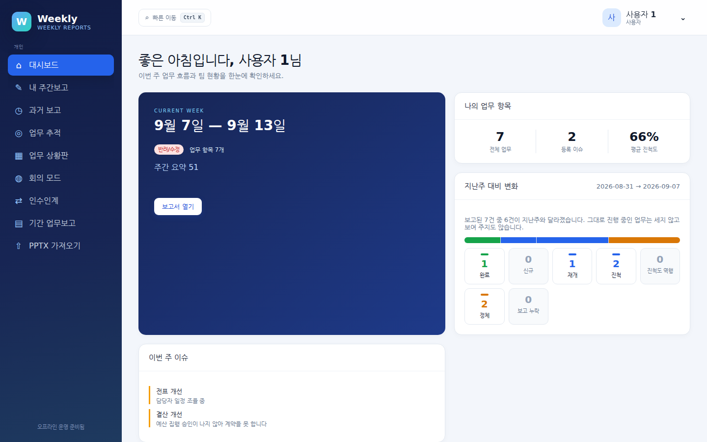

### 2.3 쓰고 제출하기

`내 주간보고`는 주간 요약 한 줄과 업무 항목의 목록입니다. 업무 항목마다 구분·제목·`금주 실적`·`차주 계획`·`이슈 및 지원요청`·`진척도(%)`를 씁니다.

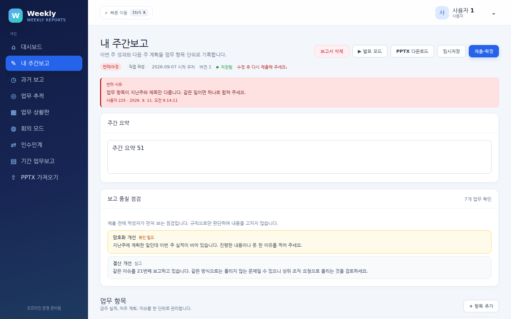

1. 상단 주차 표기(예: `2026-09-07 주차`)가 이번 주인지 확인합니다.
2. `주간 요약`을 한두 줄로 씁니다.
3. `+ 항목 추가`로 업무를 넣고 실적·계획·이슈·진척도를 채웁니다. 입력창은 내용에 맞춰 자동으로 늘어납니다.
4. `임시저장`으로 중간 저장합니다.
5. 다 쓰면 `검토 요청`을 누릅니다. 상태가 `SUBMITTED`가 되고 팀장의 검토 대상이 됩니다. 검토 절차를 쓰지 않는 배포에서는 이 버튼이 `제출·확정`이고 상태는 곧 `CLOSED`입니다.

여기까지가 첫 성과입니다. 팀장이 승인하면 `APPROVED`, 보완을 요청하면 `REVISION_REQUESTED`로 돌아오고 대시보드 카드에 `반려/수정` 배지가 뜹니다.

---

## 3. 화면별 사용법

왼쪽 메뉴의 순서대로입니다. `Ctrl K`(빠른 이동)로 화면 이름을 쳐서 바로 갈 수도 있습니다.

### 3.1 대시보드

이번 주 보고서 상태, 나의 업무 항목 수·이슈 수·평균 진척도, 지난주 대비 변화(완료·신규·재개·진척·정체·보고 누락), 이번 주 이슈를 한 화면에 모읍니다. 그림은 2.2 절에 있습니다.

### 3.2 내 주간보고

작성·제출 화면입니다(2.3 절). 그 밖에 이 화면에서 하는 일:

- **수정·삭제**: 본인 보고서는 제출 뒤에도 고칠 수 있습니다. 제출·승인·확정된 보고서를 수정하면 기존 검토 결과가 해제되고 `DRAFT`로 돌아가므로 다시 제출해야 합니다. 검토 절차를 쓰지 않는 배포에서는 제출이 곧 확정(`CLOSED`)이며 확정본을 고쳐도 같은 규칙입니다. 삭제는 확인 창을 거치며 항목·댓글·상태 이력이 함께 지워져 복구할 수 없습니다.
- **동시 편집 충돌**: 다른 곳에서 먼저 저장되면 저장이 거절됩니다. **새로고침하지 말고 저장을 한 번 더** 누르십시오 — 화면에 쓴 내용은 그대로 남아 있고 새로고침은 그것을 지웁니다(5장 참고).
- **▶ 발표 모드**: 이 보고서를 슬라이드로 넘겨 보며 말할 때 씁니다. `Esc`로 나옵니다.
- **PPTX 다운로드**: 관리자가 등록한 사내 템플릿으로 이 보고서를 내보냅니다(4.6 절).
- **화면 캡처 첨부**: 보고서에 이미지를 붙이면 PPTX 의 캡처 슬라이드로 함께 나갑니다. `본문 앞/뒤` 배치를 고를 수 있습니다.
- **주차 시작 요일이 바뀐 주**: 관리자가 주차 시작 요일을 바꾸면 그 다음 한 주 동안만 주차 표기가 이전과 달라집니다. 작성 화면은 이번 7일을 덮고 있는 기존 보고서를 그대로 열어 주므로 이어서 쓰면 됩니다. 같은 기간에 보고서를 새로 만들 수는 없습니다.
- **AI 로 초안 만들기**·**Confluence 자동 초안**: 관리자가 켠 경우에만 보입니다(4.7·4.9 절).

### 3.3 과거 보고

내가 쓴 보고서의 목록입니다. 행을 누르면 상세가 열리고, 거기서 수정·삭제·복제·PPTX 내보내기를 합니다. 오른쪽 위 `전체 상태`로 상태별로 거릅니다.

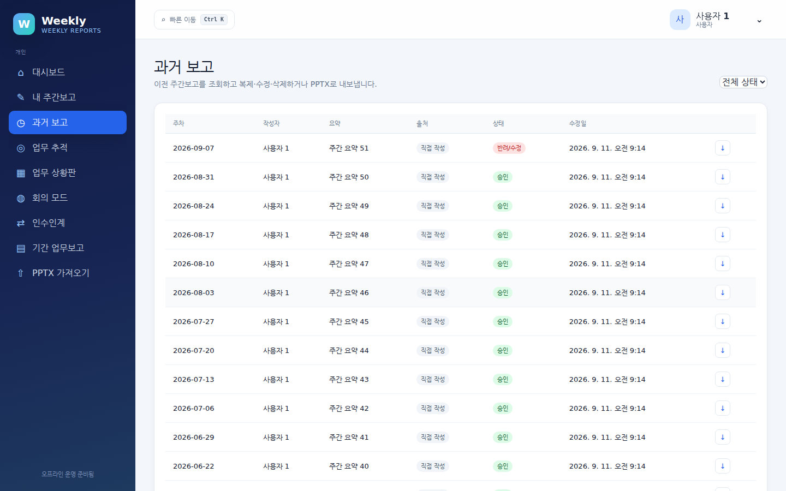

### 3.4 업무 추적

보고서를 주 단위로 쓰다 보면 같은 업무가 여러 주에 걸칩니다. 이 화면은 그 업무 하나를 이어 붙여 **몇 주째 진행 중인지, 몇 주째 보고가 없는지, 진척도가 어떻게 움직였는지**를 보여 줍니다. 행을 누르면 그 업무의 주별 이력이 열리고, 마감일·선행 관계·결정 기록을 남길 수 있습니다. 팀장은 팀원의 업무도 봅니다.

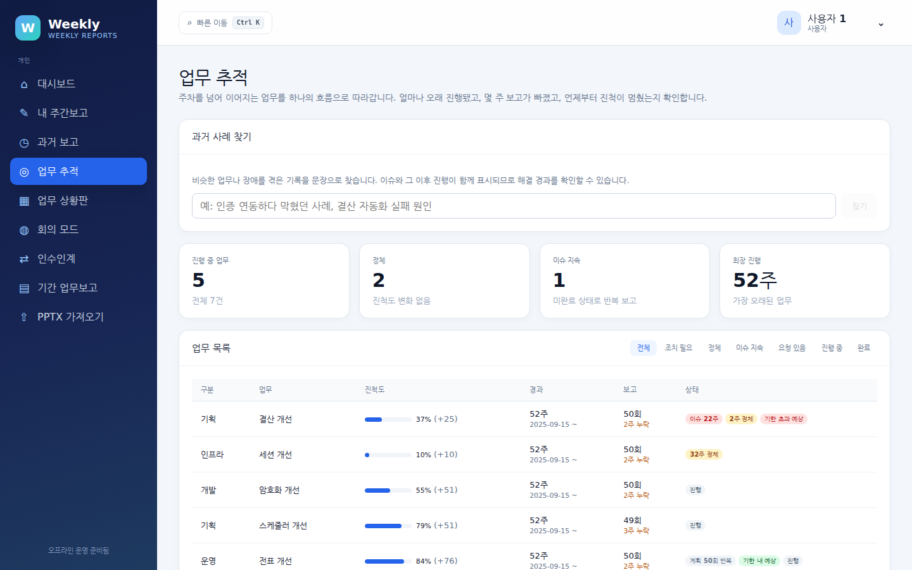

### 3.5 업무 상황판 (업무 캘린더)

부서의 한 달을 한 화면에 놓고, 끝난 일을 **체크박스로 지우는** 화면입니다.

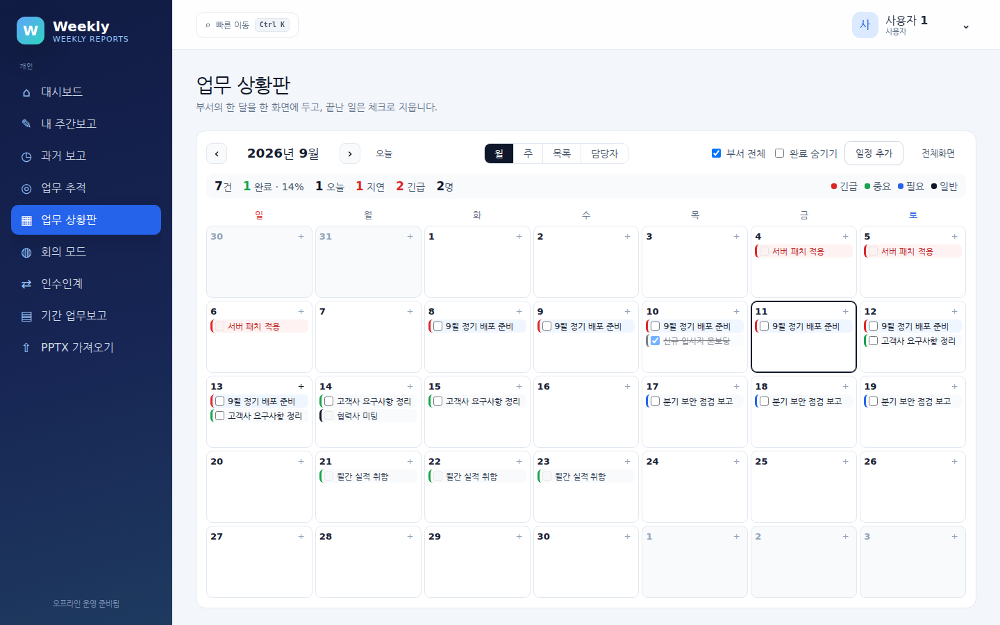

**보기 네 가지**

| 보기 | 쓰는 때 |
|---|---|
| 월 | 달력 격자. 한 달 전체를 계획하고 훑을 때 |
| 주 | 그 주 7일을 세로로. 아침 회의에서 이번 주를 볼 때 |
| 목록 | 기간·중요도·업무·담당자·완료 표. 순서대로 처리할 때 |
| 담당자 | 사람별 묶음과 완료율 막대. 누가 무엇을 얼마나 들고 있는지 볼 때 |

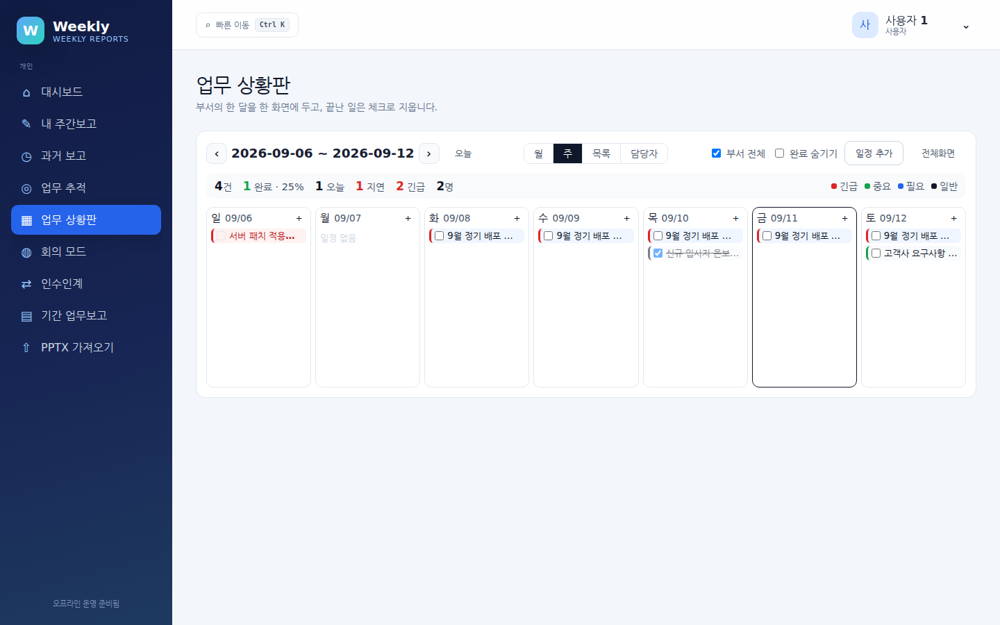

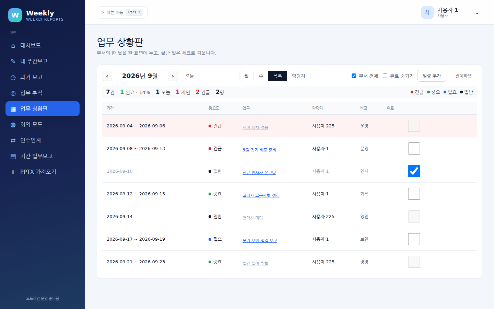

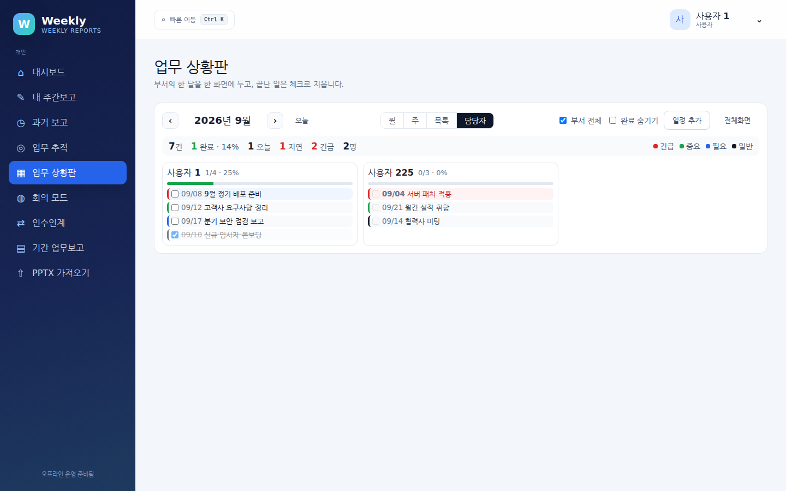

**중요도와 색**

| 중요도 | 색 |
|---|---|
| 긴급 | 빨강 |
| 중요 | 초록 |
| 필요 | 파랑 |
| 일반 | 검정 |

색은 줄 왼쪽 테두리에 있고 글자로도 함께 표시합니다. 하루 안에서는 긴급이 맨 위에 옵니다.

**일정 추가와 체크**

1. 날짜 칸의 `＋` 를 누르거나 칸을 더블클릭하면 그 날짜로 추가 창이 열립니다. 위쪽 `일정 추가` 버튼도 같습니다.
2. 업무명, 시작일, 종료일(비우면 하루), 중요도, 구분, 비고를 입력합니다. 팀장·조직장·관리자는 담당자를 조직원 중에서 고를 수 있습니다.
3. 체크박스를 누르면 그 자리에서 완료로 바뀝니다. **누가 언제** 체크했는지 함께 기록되며, 해제하면 둘 다 지워집니다.
4. 완료한 일은 취소선으로 남습니다. 위쪽 `완료 숨기기`로 감출 수 있습니다 — 감추는 것은 줄뿐이고 완료율과 `n/m`은 그대로입니다.

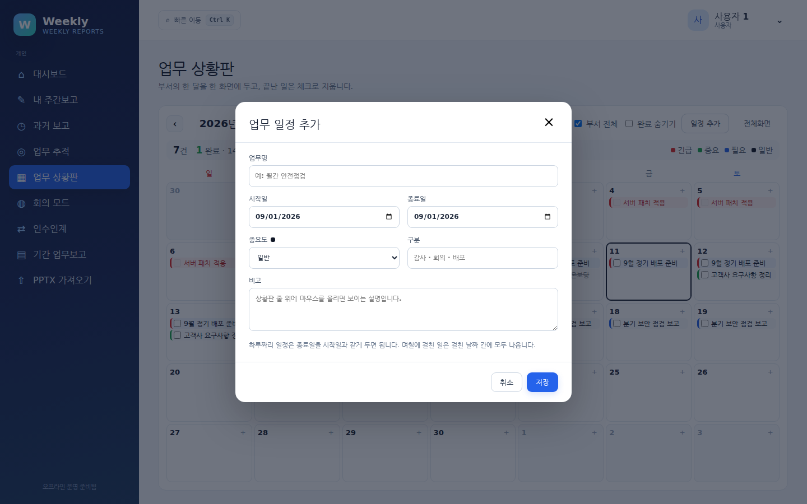

**보이는 범위**

- 상황판은 공유 계획이므로 `부서 전체`를 켜면 **본인 조직과 하위 조직 전체**의 일정이 보입니다. 끄면 본인 것만 봅니다.
- 다만 **체크·수정·삭제는 본인 일정**만 할 수 있습니다. 팀장·조직장은 담당 조직원의 일정도 다룰 수 있고, 남의 조직 일정은 보이지도 않습니다. 권한이 없는 줄의 체크박스는 비활성으로 표시됩니다.
- `지연`·`오늘` 판정은 서비스 시간대의 오늘을 기준으로 합니다.

**전체화면**: `전체화면` 버튼은 사무실 벽 화면용입니다. 글자와 칸이 커지고, **전체화면일 때만 60초마다 스스로 다시 읽습니다**. `Esc` 로 빠져나옵니다.

**여러 날에 걸친 일정**: 시작일과 종료일을 다르게 주면 걸친 모든 날짜 칸에 나옵니다. 8월에 시작해 9월에 끝나는 일은 8월 상황판과 9월 상황판에 모두 나옵니다.

### 3.6 회의 모드 (팀장 이상)

팀의 한 주를 안건으로 만듭니다. `신규 이슈`처럼 이야기할 것끼리 묶이며, 주차와 조직을 골라 `발표 모드`로 넘길 수 있습니다.

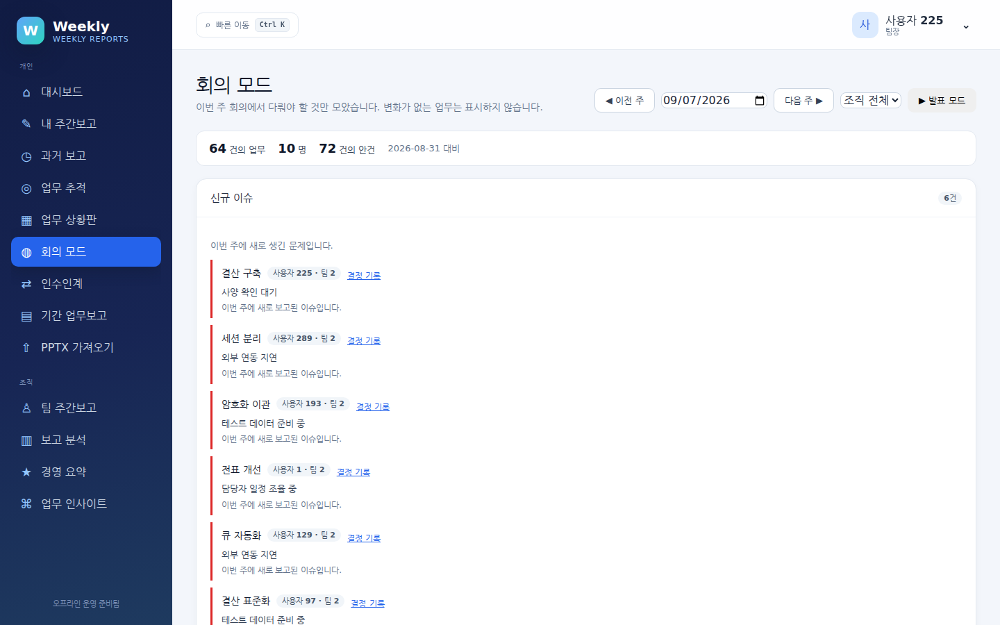

### 3.7 인수인계

담당자가 바뀔 때 그 사람이 들고 있던 업무의 이력을 한 문서로 봅니다. 사람을 고르면 이어지는 업무마다 주차별 기록이 시간순으로 펼쳐집니다.

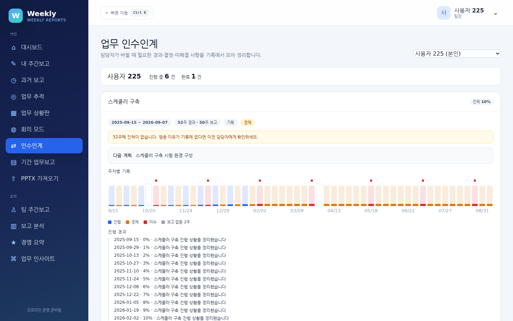

### 3.8 기간 업무보고

월간·분기·반기·연간으로 여러 주의 보고서를 하나로 묶습니다. 같은 업무는 제목 유사도로 병합되고, 제출률·평균 진척도·이슈 수와 경영 인사이트가 위에 요약됩니다. `CSV`·`PPTX 내보내기`가 있습니다.

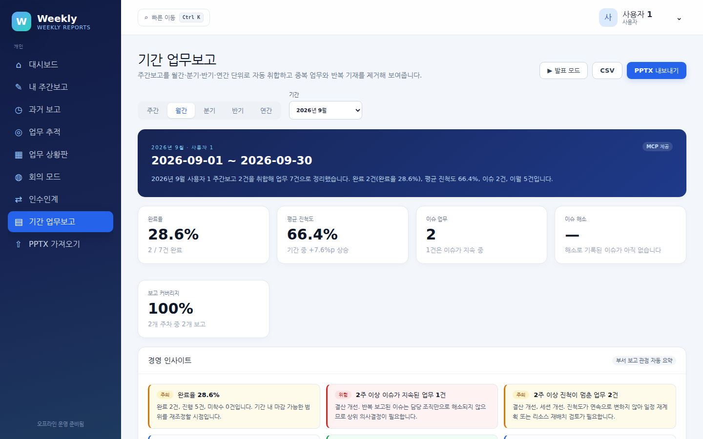

### 3.9 경영 요약 (팀장 이상)

조직의 핵심 업무 10건을 중요도 순으로 뽑아 진척과 이슈를 한 장에 놓습니다. 임원 보고 직전에 봅니다.

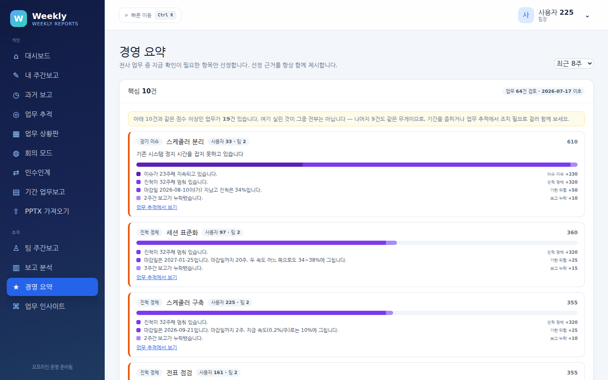

### 3.10 업무 인사이트 (팀장 이상)

여러 사람이 비슷한 업무를 따로 보고하고 있지 않은지(`중복 의심`)와 `반복 업무`를 찾아 줍니다. 그림의 시험 데이터처럼 중복이 없으면 `조직 간 중복으로 의심되는 업무가 없습니다.`로 표시됩니다.

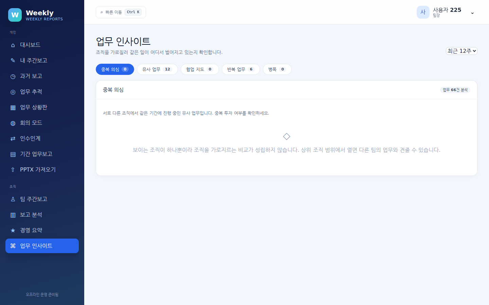

### 3.11 팀 주간보고 (팀장 이상)

팀원의 이번 주 보고서를 한 표로 보고 승인·반려합니다.

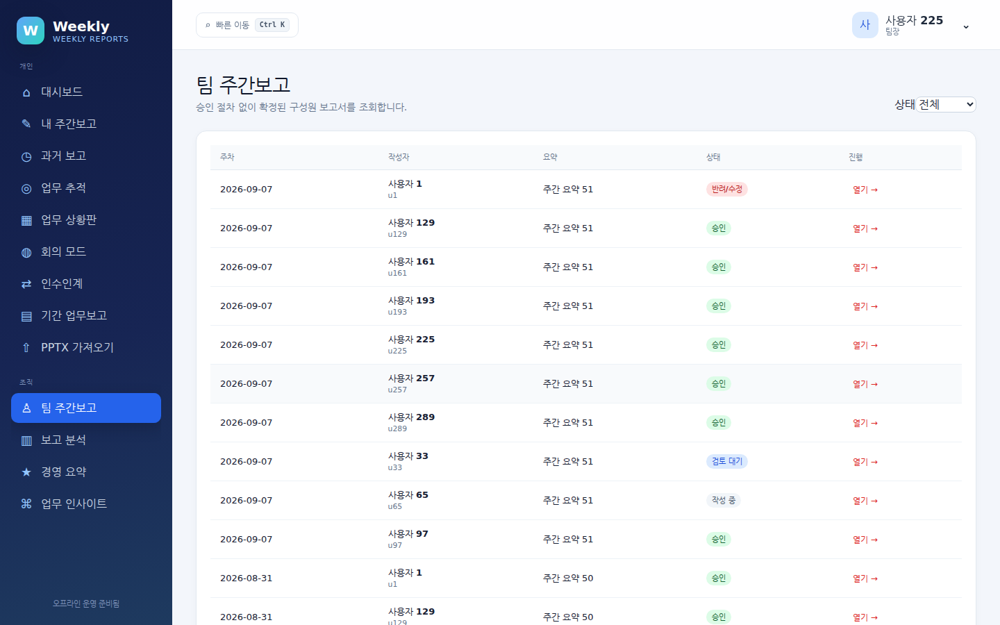

관리자 설정에서 `팀장 검토·승인 사용`이 켜져 있을 때 검토 절차가 활성화됩니다.

```
 [DRAFT (초안)]  ➔ (임직원 제출) ➔  [SUBMITTED (제출 완료)]
                                           │
                           ┌───────────────┴───────────────┐
                           ▼                               ▼
                 [APPROVED (승인 완료)]     [REVISION_REQUESTED (보완 요청)]
```

- **승인**: 내용을 확인하고 `승인`을 누르면 `APPROVED`로 확정됩니다.
- **수정 요청**: 사유를 적어 `수정 요청`을 누르면 작성자에게 알림이 가고 `REVISION_REQUESTED`로 되돌아갑니다.

### 3.12 보고 분석 (팀장 이상)

제출률, 보고서 상태 분포, 미해결 이슈, 평균 진척도와 참여 추이(정시·지각·미제출)를 봅니다. 주차 시작 요일을 바꾼 전환 주에도 이미 낸 보고서는 그 주의 것으로 셉니다.

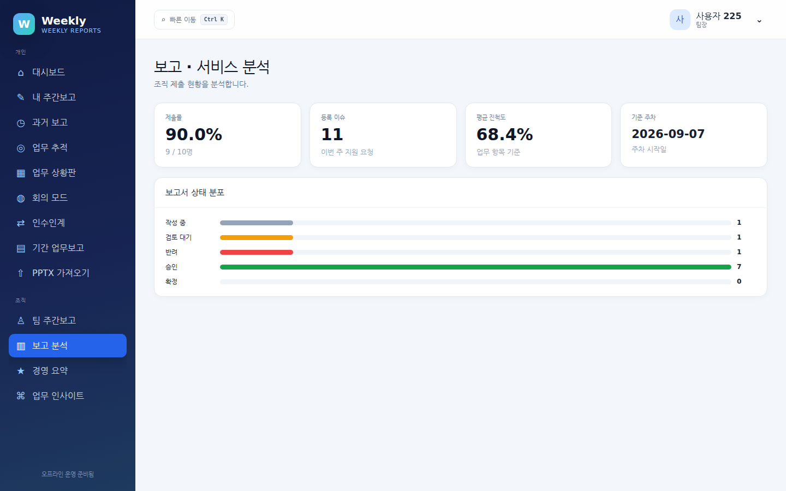

### 3.13 PPTX 가져오기

과거에 PPTX 로 쓰던 주간보고를 올려 Weekly 보고서로 바꿉니다(4.8 절). 관리자가 AI 를 켜지 않았으면 그림처럼 안내가 뜨고 올릴 수 없습니다.

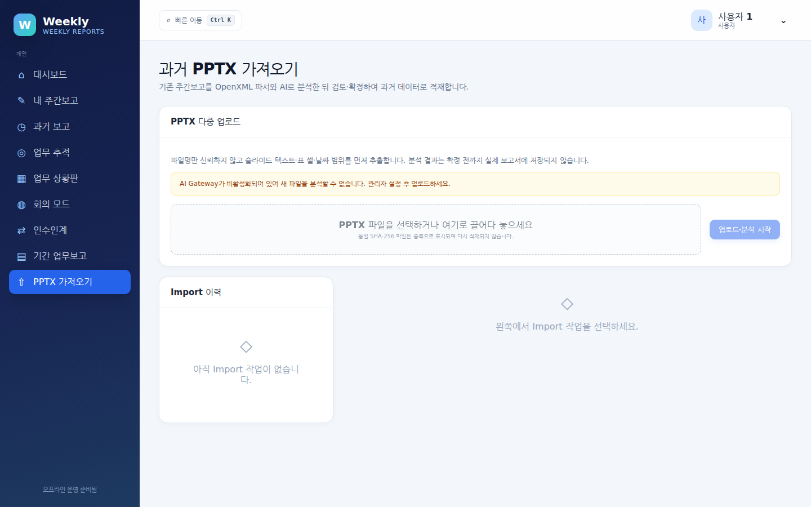

### 3.14 개인 설정 · API 키

프로필, 개인 API/MCP 키, 주간보고 자동화, 주간보고 메일 발송, (팀장 이상) 팀원 작성 권고 메일과 팀원 주간보고 자료가 카드로 있습니다.

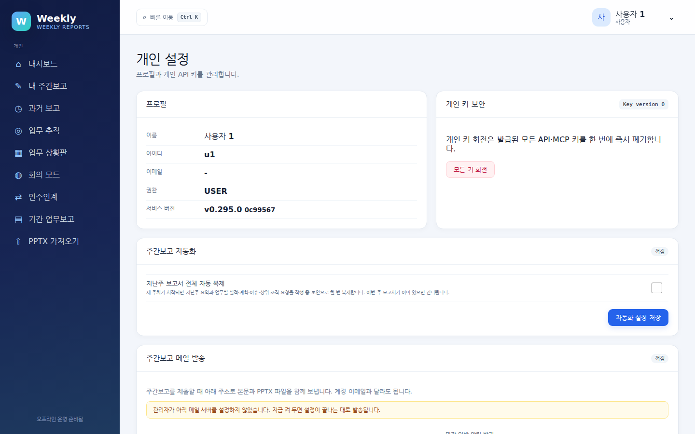

---

## 4. 자주 하는 작업

### 4.1 지난주 보고서를 복제해서 이번 주 시작하기

- `과거 보고` 상세에서 `복제`를 누르고 대상 주차를 선택합니다.
- `업무 구조만 복제`는 분류와 제목만 옮기고 주간 요약, 실적, 계획, 이슈와 진척도를 초기화하므로 새 주차 작성에 권장합니다.
- `전체 내용 복제`는 원문 전체를 옮기며 반복 업무를 편집해 사용할 때 적합합니다.
- 복제본은 항상 `DRAFT`로 생성되고 승인 이력, 댓글, Confluence/PPTX 연결과 원본 항목 ID는 복사하지 않습니다.
- 같은 대상 주차에 보고서가 이미 있으면 덮어쓰지 않고 충돌을 안내합니다.

### 4.2 매주 자동으로 초안이 생기게 하기

`개인 설정 → 주간보고 자동화`에서 선택한 뒤 `자동화 설정 저장`을 누릅니다. 두 기능은 기본으로 꺼져 있습니다.

**지난주 보고서 전체 자동 복제**

- 모든 사용자가 켤 수 있습니다. 새 보고 주차가 시작되면 정확히 한 주 전 보고서의 요약과 업무별 구분·실적·계획·이슈·상위 조직 요청·진척도를 이번 주 `DRAFT`로 한 번 복제합니다.
- 지난주 보고서에 업무 항목이 없거나 이번 주 보고서가 이미 있으면 건너뛰며, 기존 내용을 덮어쓰지 않습니다. 자동 초안을 삭제해도 같은 주에 매분 다시 만들지 않습니다.
- 댓글·승인 이력·첨부 파일·Confluence/PPTX 출처는 옮기지 않습니다. `전체 내용`이므로 끝난 실적과 지난 이슈도 들어옵니다. 이번 주 사실에 맞게 고친 뒤 제출하십시오.

**팀원 작성 권고 메일** (팀장·조직장·관리자)

- 월요일부터 일요일 중 고른 요일의 서비스 시간대 오전 9시 이후, 담당 범위에서 아직 제출하지 않은 활성 사용자에게 한 주에 한 번 보냅니다.
- 바로 권고하려면 별도 `팀원 작성 권고 메일` 카드의 `지금 권고 메일 보내기`를 누르고 확인합니다. 이 버튼은 자동 발송 스위치와 선택 요일에 관계없이 이번 주 대상을 다시 확인하며, 자동화 설정을 켜거나 저장하지 않습니다.
- 팀장과 조직장은 자기 조직의 하위 조직까지, 관리자는 전체 사용자를 대상으로 하며 권고한 본인은 제외됩니다. 여러 관리자의 범위가 겹쳐도 받는 사람은 같은 주에 한 통만 받습니다.
- 사용자가 개인 설정의 `주간보고 메일 발송`에 저장한 주소가 있으면 그 주소로, 없으면 계정 이메일로 갑니다.
- 수동 요청 뒤에는 권고 대상, 새로 발송 대기열에 넣은 인원, 이미 발송했거나 대기 중인 인원과 주소가 없어 건너뛴 인원이 표시됩니다. 실제 SMTP 발송은 백그라운드에서 이어집니다.
- 관리자가 SMTP 를 아직 설정하지 않았다면 화면에 그 사실이 표시되고 수동 발송 버튼은 비활성화됩니다.
- 메일을 보내기 전에 보고서가 제출되거나 권고자의 역할·조직 범위가 바뀌면 예약된 권고는 취소됩니다.

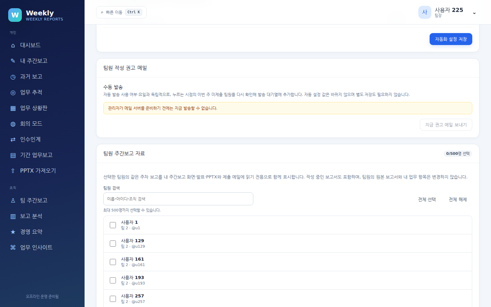

### 4.3 팀원 보고서를 내 보고서 뒤에 붙여 보기

팀장·조직장·관리자는 `개인 설정 → 팀원 주간보고 자료`에서 본인 보고와 함께 표시할 팀원을 고를 수 있습니다. 처음에는 아무도 선택되지 않습니다.

1. 이름·아이디·조직으로 검색하고 체크박스로 팀원을 고릅니다. `선택 수/500명 선택` 배지와 `최대 500명까지 선택` 안내로 상한을 확인합니다. `전체 선택`은 앞 500명까지만 고르며 `전체 해제`로 모두 풉니다.
2. `포함 설정 저장`을 누릅니다. 팀장과 조직장은 본인 조직과 전체 하위 조직의 활성 사용자, 관리자는 전체 활성 사용자를 선택할 수 있으며 본인은 목록에서 제외됩니다.
3. 보고서를 열면 선택한 팀원의 같은 주차 보고서가 `팀원 주간보고 자료`에 읽기 전용으로 표시됩니다. 초안·제출·승인·반려·확정 모든 상태가 대상이고 원래 상태가 함께 보입니다. 보고서가 없는 팀원은 `이번 주 보고서가 아직 없습니다.`로 표시됩니다.
4. 보고서 화면뿐 아니라 발표 모드, PPTX 와 제출 메일에서도 본인 내용 뒤의 별도 `선택 팀원 포함 자료` 구획으로 표시됩니다.

이 설정은 팀원의 보고서를 내 보고서로 복사하지 않습니다. 내 업무 항목·상태·버전과 팀원 원본은 그대로이며, 기간 보고·팀 종합·업무 추적·관리자 분석에 내 업무로 중복 집계되지 않습니다. 역할 강등, 조직 이동 또는 팀원 비활성화로 접근 범위가 바뀌면 해당 자료는 즉시 숨겨지며, 이미 발송하거나 다운로드한 파일은 바뀌지 않습니다.

### 4.4 제출할 때 메일로 받기, 먼저 시험해 보기

`개인 설정 → 주간보고 메일 발송`에서 받을 주소를 저장하고 `제출할 때 보내기`를 켜면, 보고서를 **제출할 때** 그 주소로 본문과 **PPTX 파일**이 함께 갑니다. 첨부는 `PPTX 다운로드`가 주는 것과 같은 파일입니다.

- `시험 발송`은 저장한 주소로 **가장 최근 주간보고**를 지금 한 통 보냅니다. 제목에 `[시험]`이 붙는 것 외에는 실제 제출 때와 같습니다.
- 시험 메일은 **언제나 본인**에게 갑니다. 저장한 주소가 없으면 계정 이메일로 가고, 둘 다 없으면 주소를 먼저 저장하라는 안내가 나옵니다. 화면에 입력만 하고 저장하지 않은 주소로는 가지 않습니다.
- 시험 발송은 발송 이력에 남지 않습니다. 한 사람당 30초에 한 번이며 그 사이에 다시 누르면 남은 시간이 표시됩니다.
- PPTX 가 10MiB 를 넘거나 만들지 못하면 메일은 그대로 가되 본문 첫 줄에 그 사실과 이유가 적힙니다.
- 관리자가 SMTP 를 설정하지 않았으면 시험 발송은 어떤 설정이 꺼져 있는지 알려 주고 아무것도 보내지 않습니다.

### 4.5 상황판 마감 임박 알림 받기

`개인 설정 → 주간보고 메일 발송`의 `마감 임박 알림 받기`를 켜면, 상황판에서 **내가 담당인 미완료 일정** 중 마감이 5일 안으로 다가온 것을 하루 한 번 메일로 받습니다. 기본은 꺼져 있고, 받을 주소는 주간보고 메일과 같은 주소를 씁니다(주소가 없으면 켜지지 않습니다).

- 남은 일수별로 묶여 옵니다: `[D-1 · 2026-10-06 마감] 2건`, `[D-2 …] 1건` 처럼 급한 것부터입니다.
- **시작일과는 무관합니다.** 아직 시작하지 않은 일도 마감이 가까우면 들어옵니다.
- **오늘 마감과 이미 지난 일은 들어오지 않습니다.** 그것은 상황판에서 빨간색으로 이미 보입니다.
- 상황판에서 **체크한 일정은 다음 알림에서 빠집니다.** 보낼 것이 하나도 없는 날은 메일이 오지 않습니다.
- 서비스 시간대 오전 9시 이후에 하루 한 통만 갑니다.

### 4.6 PPTX 로 내보내기

1. `내 주간보고`·`과거 보고` 상세 또는 `기간 업무보고`의 `PPTX 다운로드`(기간 보고는 `PPTX 내보내기`)를 누릅니다.
2. 관리자가 등록한 원본 PPTX 템플릿의 슬라이드 마스터, 레이아웃, 도형, 폰트를 그대로 유지한 채 `{{THIS_WEEK}}`, `{{NEXT_WEEK}}`, `{{ISSUES}}` 토큰 위치에 내용이 치환된 파일을 내려받습니다.

기본 4장 표 형식은 작성 순서를 바꾸지 않고 실적·계획 중 더 긴 내용과 예상 줄바꿈 수를 기준으로 업무를 균형 배치합니다. 하나의 업무 구분이 여러 장에 걸리면 각 장에 구분 제목이 다시 표시되며, 모든 업무 항목은 정확히 한 번 출력됩니다. 선택 팀원 포함 설정이 있으면 같은 주차 자료가 `선택 팀원 · 이름 (아이디)` 분류로 본인 항목 뒤에 이어집니다.

### 4.7 자유 텍스트로 AI 작성

관리자가 AI 기능을 켠 경우 보고서 작성 화면에 `AI로 초안 만들기` 영역이 표시됩니다.

1. 이번 주 한 일, 다음 주 할 일, 이슈를 텍스트 영역에 자유롭게 붙여 넣습니다.
2. `AI 분석`을 누르고 구조화된 항목과 신뢰도·경고를 확인합니다.
3. 제목, 분류, 금주 실적, 차주 계획, 이슈와 진척도를 직접 수정합니다.
4. 기존 편집 내용에 `병합`하거나 분석 결과로 `교체`합니다.
5. 일반 보고서 편집 화면에서 최종 확인한 뒤 `저장`합니다.

AI 분석 결과는 미리보기일 뿐 자동 저장되지 않습니다. 서로 독립적인 한 일·할 일·이슈는 한 줄 한 항목의 글머리표로 표시되고 같은 구조가 PPTX 의 개별 문단으로 출력됩니다. 분석 내용에 없는 사실이 추가되었거나 신뢰도가 낮게 표시되면 반드시 고친 후 적용하십시오.

### 4.8 과거 PPTX 가져오기

`PPTX 가져오기`에서 과거 보고 파일을 여러 개 선택할 수 있습니다.

1. PPTX 파일을 업로드합니다.
2. 작업 상태가 `분석 완료` 또는 `확인 필요`가 될 때까지 기다립니다.
3. 자동 감지한 주차, 요약, 업무 구분과 항목별 `원본 슬라이드`·`구분 신뢰도`를 확인합니다.
4. 잘못 분류된 항목은 내용을 수정하고 위·아래 버튼으로 순서를 조정합니다.
5. 같은 주차 보고가 있으면 `병합`, `교체`, `건너뛰기` 중 하나를 선택합니다.
6. 저장할 파일을 선택해 `확정`합니다.

같은 파일을 다시 올리면 SHA-256 중복으로 표시됩니다. 결과가 부정확하면 원본 보관기간 안에 `최신 파이프라인으로 다시 분석`으로 그 파일만 재처리할 수 있습니다. 날짜·항목·업무 구분 신뢰도가 낮거나 일부 슬라이드 내용이 잘린 `확인 필요` 파일은 기본 선택되지 않으므로 검토한 뒤 직접 선택해야 하며, 관리자 주차 시작 요일과 다른 날짜는 확정할 수 없습니다. 확정하기 전에는 정식 주간보고 데이터가 생성되지 않습니다.

### 4.9 Confluence 자동 초안 받아들이기

관리자가 연동을 활성화하면 주간보고 화면을 열었을 때 이번 주 Confluence 작성·수정 활동에서 발견한 업무 후보가 이미 표시됩니다.

1. 정규화된 업무 제목, 금주 실적, 차주 계획, 이슈와 신뢰도를 확인합니다.
2. `Confluence 출처 N건`을 펼쳐 원본 Page 제목·Space·Version 을 확인합니다.
3. 필요한 내용을 직접 고친 뒤 `초안 수정 저장`을 누릅니다.
4. 업무가 아니면 `제외`, 보고에 사용할 항목이면 `보고서에 반영`을 누릅니다.
5. 일반 업무 항목에서 최종 검토한 뒤 임시저장 또는 제출합니다.

수정한 자동 초안은 다음 동기화가 덮어쓰지 않으며, 제외한 원본 Page 는 같은 주차에 다시 나타나지 않습니다. 보고서에 반영한 경우 출처가 `Confluence 자동 초안`으로 표시됩니다.

### 4.10 ITSM SR 번호로 일정 만들기

관리자가 ITSM 연동을 켜 두었다면 상황판의 일정 추가 창 맨 위에 `SR 번호` 칸이 있습니다.

1. SR 번호(예: `SR2609-00001`)를 입력하고 `제목 가져오기` 를 누르거나 Enter 를 칩니다.
2. ITSM 에서 가져온 제목이 업무명에 채워집니다. 그대로 저장하거나 고쳐서 저장합니다.
3. 저장한 뒤에는 상황판의 그 줄에 SR 번호 배지가 붙고, 누르면 ITSM 화면이 새 탭에서 열립니다.

번호 형식이 맞지 않거나 ITSM 에 없는 번호면 그 자리에서 이유가 표시됩니다. 연동이 꺼져 있으면 이 칸은 보이지 않습니다(3.5 절 그림이 그 상태입니다).

### 4.11 API / MCP 키 발급과 AI 에이전트 연동

1. `개인 설정 · API 키`의 `개인 키 보관` 카드에서 `새 키 발급`을 누릅니다.
2. `wky_...` 형태의 키가 **발급 응답에서 한 번만** 표시됩니다. 지금 복사해 두십시오.
3. Claude Desktop 또는 Cursor 의 MCP 설정에 등록합니다. MCP 엔드포인트는 `POST /mcp`(Streamable HTTP)이며 키는 `Authorization: Bearer` 헤더로 보냅니다. 예를 들어 `mcp-remote` 같은 브리지를 쓴다면:

```json
{
  "mcpServers": {
    "weekly": {
      "command": "npx",
      "args": ["-y", "mcp-remote", "https://weekly.example.com/mcp",
               "--header", "Authorization: Bearer wky_예시_키_여기에"]
    }
  }
}
```

에이전트가 물을 수 있는 것은 이렇습니다. 주차별 제출 현황과 **미제출자 이름**(팀장 이상), 보고서 검색과 그 보고서의 **본문**, 주·월·분기·반기·연 단위 취합, **업무 상황판**의 지연·오늘·긴급 일정, 그리고 관리자라면 최근 24시간 API 상태입니다. 도구는 자기가 쓸 수 있는 것만 목록에 보이고, 인자가 규격에 맞지 않으면 무엇이 틀렸는지 문장으로 돌려줍니다.

도구 목록과 각 도구의 뜻은 [MCP 문서](MCP.md)에 있습니다. 키의 최대 유효일은 관리자 설정(`API 키 최대 유효일`)을 따릅니다.

---

## 5. 막혔을 때

화면에 실제로 뜨는 문구와 그때 할 일입니다.

| 화면의 문구 | 뜻과 할 일 |
|---|---|
| `아이디 또는 비밀번호가 올바르지 않습니다.` | 계정 유무와 관계없이 같은 문구입니다. 비밀번호를 잊었으면 관리자에게 재설정을 요청합니다. |
| `로그인 시도가 너무 많습니다. n분 후에 다시 시도하세요.` | 실패가 허용 횟수를 넘어 계정이 잠시 차단됐습니다. 차단 중에는 올바른 비밀번호도 거부되니 기다렸다가 다시 시도합니다. |
| `로그인이 필요합니다.` / `세션이 만료되어 로그아웃됐습니다. 다시 로그인해 주세요.` | 세션이 끝났습니다. 작성 중이었다면 이 탭을 그대로 두고 **새 탭에서 로그인**한 뒤 돌아와 저장합니다. |
| `Keycloak 자동 로그인을 확인하지 못했습니다. 아래 방식으로 로그인해 주세요.` | Keycloak 세션이 없거나 확인에 실패했습니다. 아이디·비밀번호 또는 `Keycloak SSO로 로그인`을 누릅니다. |
| `다른 곳에서 먼저 저장되어 이번 저장은 반영되지 않았습니다. … 저장을 한 번 더 누르면 됩니다.` | 같은 보고서를 다른 탭·기기에서 먼저 저장했습니다. **새로고침하지 말고** 저장을 한 번 더 누르십시오. 새로고침하면 지금 쓴 내용이 사라집니다. |
| `YYYY-MM-DD 주차 보고서가 같은 기간을 이미 담고 있습니다. 그 보고서를 여십시오.` | 주차 시작 요일이 바뀐 전환 주입니다. 새로 만들지 말고 안내된 보고서를 열어 이어 씁니다. |
| `… 주차 보고서가 이미 있습니다.` (복제) | 대상 주차에 보고서가 있어 복제하지 않았습니다. 다른 주차를 고르거나 기존 보고서를 엽니다. |
| `이 보고서를 검토할 권한이 없습니다.` / `요청을 수행할 권한이 없습니다.` | 역할이나 조직 범위 밖입니다. 담당 팀장이 맞는지 관리자에게 확인합니다. |
| `이 업무 일정을 수정할 권한이 없습니다.` | 상황판에서 남의 조직 일정이거나 본인이 담당·등록자가 아닙니다. 담당자나 그 팀장에게 요청합니다. |
| `담당자 본인의 업무에만 연결할 수 있습니다.` | 상황판 일정에 업무 추적 항목을 연결할 때 담당자가 아닌 사람의 업무를 골랐습니다. |
| `메일 릴레이가 준비되지 않았습니다. 관리자에게 SMTP 설정 확인을 요청하십시오.` | 관리자가 SMTP 를 아직 설정하지 않았습니다. 관리자에게 넘깁니다. |
| `메일 설정을 읽을 수 없습니다.` (시험 발송) | 같은 원인입니다. 어떤 설정이 문제인지 문구가 함께 나오니 관리자에게 그대로 전합니다. |
| `AI Gateway가 요청 한도를 초과했다고 답했습니다(HTTP 429). 잠시 후 다시 시도하세요.` / `AI 분석 시간이 초과되었습니다.` | AI 게이트웨이 쪽 제한입니다. 잠시 뒤 다시 누르고, 반복되면 관리자에게 알립니다. |
| `AI Gateway가 비활성화되어 있어 새 파일을 분석할 수 없습니다. 관리자 설정 후 업로드하세요.` (PPTX 가져오기) | 관리자가 AI 를 켜지 않았습니다. 이 기능은 관리자 설정이 필요합니다. |
| `선택한 파일은 확정할 수 있는 상태가 아닙니다.` / `일부 파일이 이미 확정되었거나 원본 보관기간이 지나 재분석할 수 없습니다.` | Import 파일의 상태가 바뀌었습니다. 목록을 다시 열어 상태를 확인합니다. |
| `첨부 이미지를 찾을 수 없습니다.` / 캡처 패널의 `파일 없음` | 서버의 첨부 파일이 유실됐습니다. 관리자에게 넘깁니다(볼륨 복구 사안). 다시 업로드하면 됩니다. |

관리자에게 넘길 때는 화면의 문구를 그대로 적어 보내십시오. 관리자 가이드의 장애 대응 절이 그 문구로 찾게 되어 있습니다.

---

## 6. 용어

| 용어 | 뜻 |
|---|---|
| 주차 | 보고서 하나가 덮는 7일. 시작 요일은 관리자 설정(`주차 시작 요일`)을 따르며 화면에는 `2026-09-07 주차`처럼 시작일로 표시됩니다 |
| DRAFT / SUBMITTED / APPROVED / REVISION_REQUESTED / CLOSED | 초안 / 제출 완료 / 승인 완료 / 보완 요청 / 확정. 검토 절차를 쓰지 않는 배포에서는 제출이 곧 CLOSED 입니다 |
| 업무 항목 | 보고서 안의 한 줄. 구분·제목·금주 실적·차주 계획·이슈·진척도로 이루어집니다 |
| 이어지는 업무 | 여러 주에 걸쳐 같은 제목으로 보고된 업무. `업무 추적`이 이것을 한 줄로 묶습니다 |
| 정체 | 진척도가 일정 주 수 이상 움직이지 않은 업무. 주 수는 관리자 설정(`정체 판정 주차 수`) |
| 보고 누락 | 지난주에는 있었는데 이번 주 보고서에 없는 업무 |
| 선택 팀원 포함 자료 | 팀장이 개인 설정에서 고른 팀원의 같은 주차 보고서를 본인 보고서 뒤에 읽기 전용으로 붙인 것 |
| 상황판 | 업무 캘린더. 주간보고와 별개로 다가올 달의 일정을 담당자·중요도와 함께 놓고 체크로 지웁니다 |
| SR | ITSM 의 서비스 요청 번호. 관리자가 연동을 켜면 상황판 일정에 붙습니다(화면 표기 이름은 관리자가 바꿀 수 있습니다) |
| MCP | AI 클라이언트(Claude Desktop, Cursor 등)가 Weekly 의 보고서를 도구로 읽는 프로토콜. 개인 키로 인증합니다 |
| 발표 모드 | 보고서나 회의 안건을 슬라이드로 넘겨 보는 전체 화면. `Esc`로 나옵니다 |
